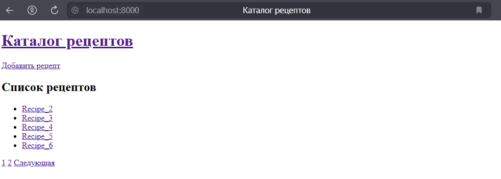
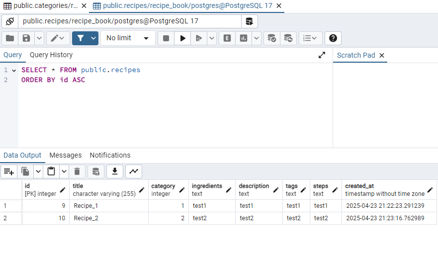
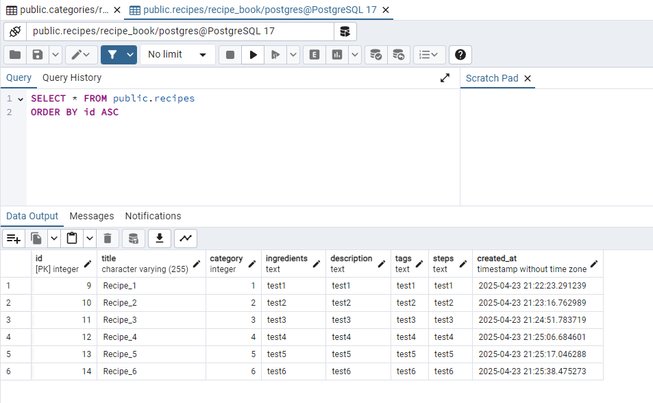
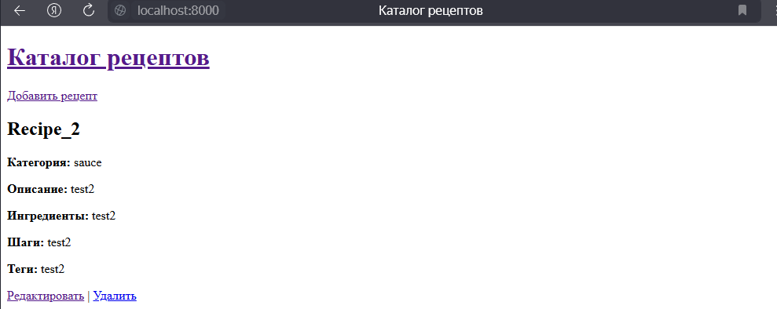
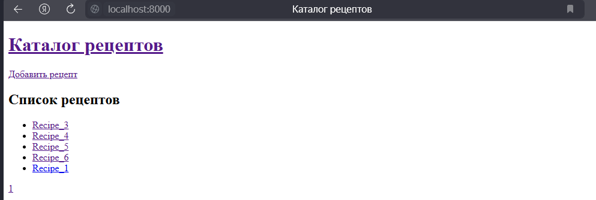

# Лабораторная работа №5. Работа с базой данных

## Цель работы

Освоить архитектуру с единой точкой входа, подключение шаблонов для визуализации страниц, а также переход от хранения данных в файле к использованию базы данных (MySQL).

## Условия

Продолжите разработку проекта, начатого в предыдущей лабораторной работе. Необходимо:

1. Реализовать архитектуру с единой точкой входа (`index.php`), обрабатывающей все входящие HTTP-запросы.
2. Настроить базовую систему шаблонов с использованием файла `layout.php` и отдельных представлений для разных страниц.
3. Перенести логику работы с рецептами из файловой системы в базу данных (например, MySQL).

## Задание 1. Подготовка среды

На данном шагу создал базу данных под названием `recipe_book`, и 2 таблицы в ней, для рецептов и категорий.

```sql

-- Создание таблицы категорий
CREATE TABLE categories (
  id INT AUTO_INCREMENT PRIMARY KEY,
  name VARCHAR(100) NOT NULL UNIQUE,
  created_at TIMESTAMP DEFAULT CURRENT_TIMESTAMP
);

-- Создание таблицы рецептов
CREATE TABLE recipes (
  id INT AUTO_INCREMENT PRIMARY KEY,
  title VARCHAR(255) NOT NULL,
  category INT NOT NULL,
  ingredients TEXT,
  description TEXT,
  tags TEXT,
  steps TEXT,
  created_at TIMESTAMP DEFAULT CURRENT_TIMESTAMP,
  FOREIGN KEY (category) REFERENCES categories(id) ON DELETE CASCADE
);
```

## Задание 2. Архитектура и шаблонизация

1. В корневой папке `public/` создан файл `index.php`, который служит основной точкой входа.
2. Настроена маршрутизация, которая обрабатывает запросы к различным страницам приложения.
3. Создан файл `templates/layout.php`, который является базовым шаблоном для всех страниц.
4. Созданы шаблоны для следующих страниц:
   - `index` — отображение всех рецептов. (По умолчанию)
    
   - `create` — форма добавления рецепта.
   - `recipe` — страница с подробной информацией о рецепте.

### Структура проекта

```txt
recipe-book/
├── public/
│   └── index.php
├── src/
│   ├── handlers/
│   │   ├── recipe/
│   │   │   ├── create.php
│   │   │   ├── edit.php
│   │   │   └── delete.php
│   ├── db.php
│   ├── helpers.php
├── config/
│   └── db.php
├── templates/
│   ├── layout.php
│   ├── index.php
│   └── recipe/
│       ├── create.php
│       ├── edit.php
│       └── show.php
└── README.md
```

## Задание 3. Подключение к базе данных

- В файле `src/db.php` реализована функция подключения к базе данных с использованием PDO.
- Параметры подключения хранятся в файле `config/db.php`.
- Функция подключения возвращает экземпляр PDO, настроенный на выбрасывание исключений (`PDO::ERRMODE_EXCEPTION`).

## Задание 4. Реализация CRUD-функциональности

- Реализованы обработчики следующих операций:
  - Добавление рецепта (`handlers/recipe/create.php`)
  До добавления рецепта:
  
  После добавления рецепта:
  
  - Редактирование рецепта (`handlers/recipe/edit.php`)
  До редактирования рецепта:
  
  После редактирования рецепта:
  
  - Удаление рецепта (`handlers/recipe/delete.php`)
  
- Все данные хранятся и извлекаются из базы данных.
- Реализована проверка и валидация данных на стороне сервера.

## Задание 5. Защита от SQL-инъекций

- Использованы подготовленные выражения для выполнения SQL-запросов, чтобы избежать SQL-инъекций.
- Проверено, что все входные данные корректно экранируются и валидируются перед выполнением запросов к базе данных.
- Пример SQL - инъекции и способ ее предотвращения описаны ниже, в разделе "Контрольные вопросы"

## Задание 6. Документация кода

Код корректно задокументирован, используя стандарт PHPDoc.

## Задание 7. Контрольные вопросы

1. **Какие преимущества даёт использование единой точки входа в веб-приложении?**
   - Упрощает структуру приложения, централизует обработку всех входящих запросов, позволяет легче управлять маршрутизацией и улучшает безопасность, так как контролируется весь входящий трафик.

2. **Какие преимущества даёт использование шаблонов?**
   - Шаблоны позволяют разделить логику приложения и представление, что улучшает поддерживаемость кода. Также это ускоряет разработку, позволяет повторно использовать компоненты и снижает вероятность ошибок при изменении визуальной части приложения.

3. **Какие преимущества даёт хранение данных в базе по сравнению с хранением в файлах?**
   - Хранение в базе данных позволяет лучше организовать структуру данных, обеспечивать быстрый доступ и фильтрацию. Это также упрощает выполнение сложных запросов, обновлений и удалений данных. В отличие от файлов, базы данных поддерживают транзакции, индексацию и масштабируемость.

4. **Что такое SQL-инъекция? Придумайте пример SQL-инъекции и объясните, как её предотвратить.**
   - SQL-инъекция — это уязвимость в приложении, которая позволяет злоумышленнику вставить вредоносный SQL-код в запросы к базе данных. Это может привести к несанкционированному доступу к данным, их изменению или удалению.

   Пример SQL-инъекции:

    ```sql
   SELECT * FROM users WHERE username = '' OR 1=1 --' AND password = '';
    ```

    Этот запрос всегда возвращает всех пользователей, так как условие OR 1=1 всегда истинно.

    - Для предотвращения SQL-инъекций необходимо:
        1. Использовать подготовленные выражения и параметры в SQL-запросах.
        2. Экранировать все пользовательские входные данные.
        3. Применять проверки и фильтрацию входных данных.

## Задание 8. Выводы

В ходе лабораторной работы мною была доработана предыдущая лабораторная работа, а именно:

- Настроенно подключение к БД `PostgreSQl`
- Храниние всех данных было настроенно в базе данных, а не в текстовом файле
- Были созданы SQL-инъекции, для безопасного доступа к бд и предотвращения хакерских атак.
- Был реализован фукнционал для создания рецепта, редактирования и удаления текущих

Как итог, проект полностью фукнционирует, и поставленная цель была достигнута.

## Задание 9. Библиография

`https://moodle.usm.md/mod/assign/view.php?id=305371`
`https://github.com/MSU-Courses/advanced-web-programming/tree/main/Lab/05_Database`
`https://neon-next-pp.vercel.app/postgresql/postgresql-php/connect`
