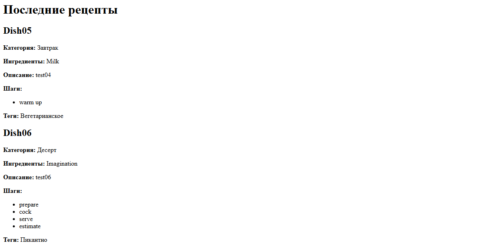
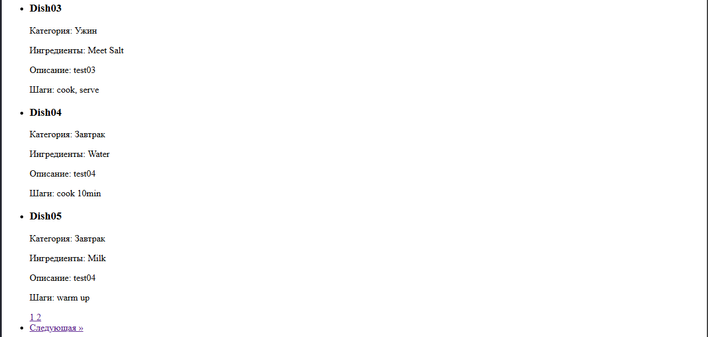

# Лабораторная работа №4: Обработка и валидация форм

## Цель работы

Целью данной лабораторной работы является освоение основных принципов работы с HTML-формами в PHP, включая отправку данных на сервер, их обработку и валидацию. Эта работа станет основой для дальнейшего изучения разработки веб-приложений. Дальнейшие лабораторные работы будут строиться на знаниях и навыках, полученных в рамках этой работы.

## Условие

Для выполнения лабораторной работы используется проект **"Каталог рецептов"**. В рамках этого проекта необходимо реализовать функционал для добавления новых рецептов в каталог. Каждое добавление рецепта должно включать в себе формы ввода данных, валидацию введенных данных и их сохранение в файл.

## Описание проекта

Проект представляет собой веб-приложение, которое позволяет пользователям добавлять рецепты в каталог. Каждый рецепт состоит из следующих данных:

- Название рецепта
- Категория (например, завтрак, обед, ужин и т. д.)
- Список ингредиентов
- Описание рецепта
- Шаги приготовления
- Теги (например, быстро, полезно, пикантно и т. д.)

Данные рецептов сохраняются в текстовый файл в формате JSON.

### Структура проекта

Проект состоит из нескольких основных файлов:

1. **index.php** — отображение списка рецептов с пагинацией.
2. **add_recipe.php** — форма для добавления нового рецепта.
3. **save_recipe.php** — обработка и сохранение рецепта.
4. **helpers.php** — вспомогательные функции для фильтрации и обработки данных.

### Функционал

1. **Добавление рецепта**:
    - Форма для добавления нового рецепта, включая поля для названия, категории, ингредиентов, описания, шагов приготовления и тегов.
    - Валидация данных на стороне сервера.
    - Возможность добавления нескольких шагов приготовления с помощью динамически добавляемых полей.
    
    
    - Рецепт сохраняется в текстовый файл `recipes.txt` в формате JSON.

2. **Просмотр рецептов**:
    - Отображение списка рецептов с возможностью пагинации.
    - Каждый рецепт отображается с названием, категорией, ингредиентами, описанием и шагами приготовления.

## Пример использования

### Добавление нового рецепта

1. Открыть страницу добавления рецепта ( `create.php`).
2. Заполнить форму с данными рецепта:
   - Название рецепта
   - Категория
   - Ингредиенты
   - Описание
   - Шаги приготовления
   - Теги
3. Нажать кнопку "Отправить".
4. Если данные валидны, рецепт будет сохранен в файл `recipes.txt`.

### Просмотр рецептов

1. Перейти на главную страницу (`public/index.php`).

2. Просмотреть список рецептов с пагинацией(`public/recipes/index.php`)

3. Каждый рецепт отображается с его данными.

## Важные замечания

- Все данные проходят валидацию на сервере. Если какое-либо обязательное поле не заполнено, то форма не будет отправлена и будет показана соответствующая ошибка.

## Ответы на контрольные вопросы

### Какие методы HTTP применяются для отправки данных формы?

- **GET** — данные передаются через URL (менее безопасно, ограничен по длине).
- **POST** — данные передаются в теле запроса (подходит для конфиденциальной и объемной информации).

### Что такое валидация данных и чем она отличается от фильтрации?

- **Валидация** — это проверка корректности введённых данных (например: заполнено ли поле, соответствует ли формат email и т.д.).
- **Фильтрация** — это очистка данных от потенциально опасных или лишних символов (например: удаление пробелов, экранирование HTML).

### Какие функции PHP используются для фильтрации данных?

- `trim()` — удаляет пробелы по краям строки.
- `htmlspecialchars()` — экранирует специальные HTML-символы.
- `filter_var()` — применяет встроенные фильтры PHP (например, FILTER_VALIDATE_EMAIL, FILTER_SANITIZE_STRING и др.).